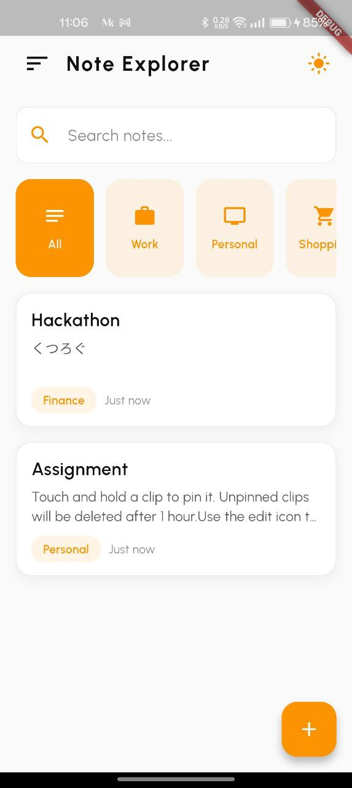
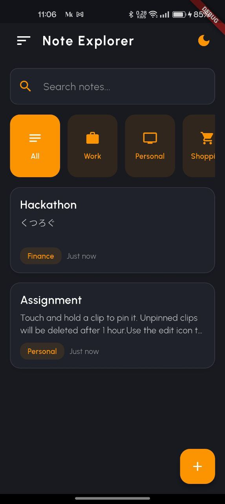
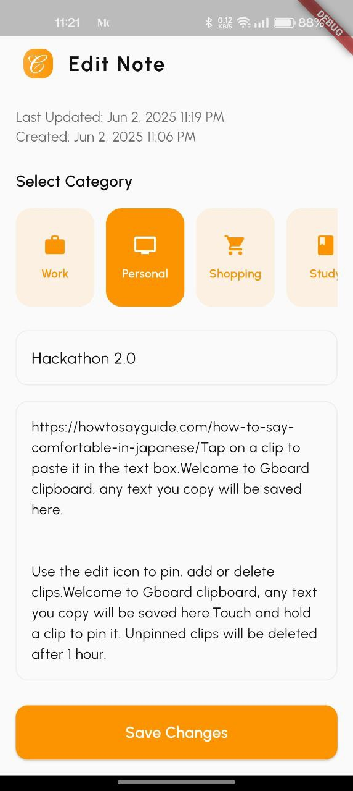
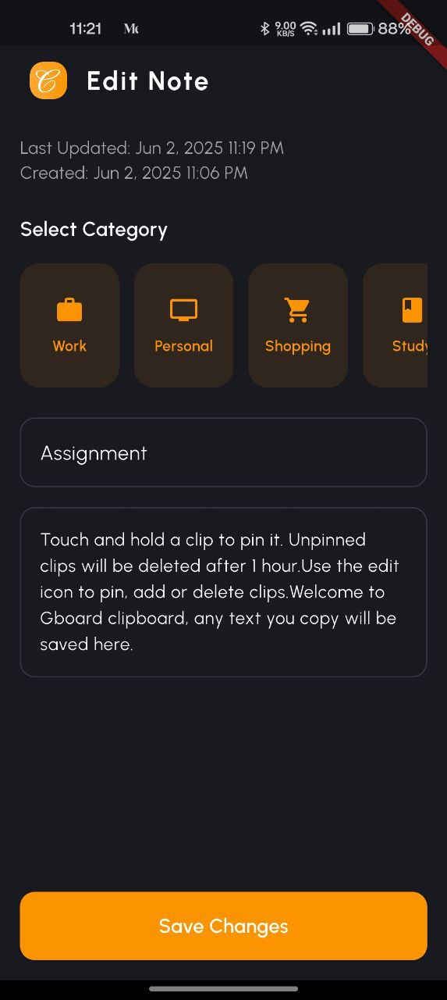
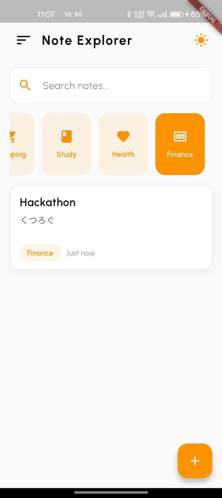
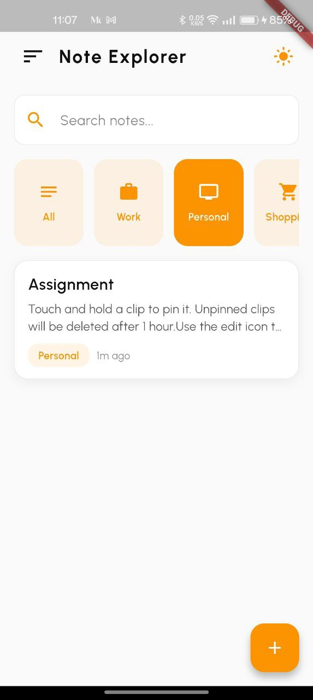

# Note Explorer - A Modern Notes App

<div align="center">
  
  <h2>A beautiful and feature-rich notes app built with Flutter</h2>
</div>

## Features

### Note Management
- Create, edit, and delete notes with rich text support
- Categorize notes with predefined categories
- Swipe-to-delete with undo capability
- View creation and last modified timestamps

### Search & Organization
- Search notes by title and content
- Filter notes by categories
- Multiple sorting options:
  - Latest First
  - Oldest First
  - Title (A-Z)
  - Title (Z-A)

### Beautiful UI
- Modern, clean interface
- Dark and Light theme support
- Theme persistence
- Smooth animations and transitions
- Responsive design
- Material Design 3 components

### Technical Features
- GetX state management
- SQLite for local storage
- Theme persistence using GetStorage
- Clean architecture
- Reactive UI updates

## Getting Started

### Prerequisites
- Flutter (latest version)
- Android Studio / VS Code
- Git

### Installation
1. Clone the repository
```bash
git clone https://github.com/yourusername/note-explorer.git
```

2. Navigate to project directory
```bash
cd note-explorer
```

3. Install dependencies
```bash
flutter pub get
```

4. Run the app
```bash
flutter run
```

## Screenshots

| |  |
|------------|------------|
|  |  |
|  |  |
|  |  |

## 🏗 Architecture

The app follows a clean architecture pattern:

```
lib/
  ├── data/           # Data layer (SQLite, repositories)
  ├── presentation/   # UI layer (pages, controllers, widgets)
  ├── utils/         # Utilities and helpers
  └── routes/        # App routing
```

## 📄 License
This project is licensed under the MIT License - see the [LICENSE](LICENSE) file for details

---

### 👨🏻‍💻 Connect with me

<p align="left">
   
<a href="https://twitter.com/GauravKush1225" target="blank"></a>
<a href="https://www.linkedin.com/in/gaurav-kushwaha-330a39251/" target="blank"></a>
<a href="https://www.instagram.com/kush.gaurav12/" target="blank"></a>
<a href="https://www.youtube.com/@gauravkushwaha7207" target="blank"></a>

</p>

